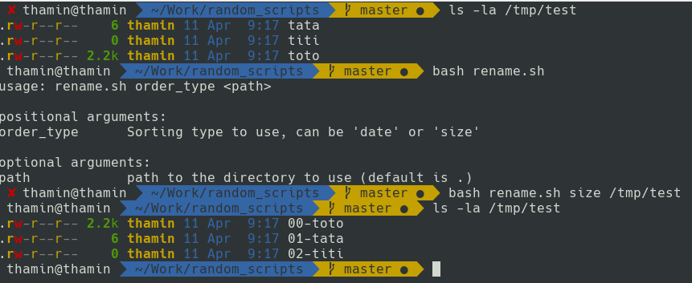

### Summary
- [introduction](#INTRODUCTION)
- [test_python_imports](#TEST_PYTHON_IMPORTS)
- [20-docker-stats](#20_DOCKER_STATS)
- [rename](#RENAME)
____

### INTRODUCTION
_This repository contains various homemade scripts_
____

### TEST_PYTHON_IMPORTS
_This script is useful in big python projects when you want to check that all your imported modules are available in your environment_
- You can access the help by launching `python test_python_imports.py --help`:
```shell script
usage: test_python_imports.py [-h] [--dump-errors] [--dump-success] [--dump-requirements] path

positional arguments:
  path                 Path to the project directory you want to check

optional arguments:
  -h, --help           show this help message and exit
  --dump-errors        Dump list of unsuccessfully imported modules
  --dump-success       Dump list of successfully imported modules
  --dump-requirements  Dump successfully imported modules and their version (as in requirements files)
```
- An example of use could be:
```shell script
$>python test_python_imports.py "/tmp/random_scripts" --dump-requirements

REQUIREMENTS:
click==7.1.1
werkzeug==1.0.1
```
____

### 20_DOCKER_STATS
_this scripts add a docker stats paragraph to the MOTD of your UNIX system_
- You can test it with:
```shell script
bash 20-docker-stats
```
- If you want to add it to your MOTD:

```shell script
# Check you don't already have a file name `20-***` in `/etc/update-motd.d/`
ls -la /etc/update-motd.d/

# Add the bash script to your system MOTD folder
sudo cp ./20-docker-stats /etc/update-motd.d/
```
____

### RENAME
_this scripts renames all files in a directory by sorting them (by date or size) and adding a counter in front on them_
- You can access the help by launching `bash rename.sh`:
```shell script
usage: rename.sh order_type <path>

positional arguments:
order_type	Sorting type to use, can be 'date' or 'size'

optional arguments:
path		path to the directory to use (default is ".")
```
- Here is a basic example of use:


