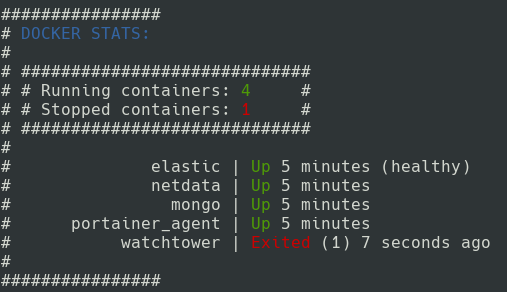

### Summary
- [introduction](#INTRODUCTION)
- [test_python_imports](#TEST_PYTHON_IMPORTS)
- [20-docker-stats](#20_DOCKER_STATS)
- [rename](#RENAME)
- [exec_task_in_bg](#EXEC_TASK_IN_BG)
- [exec_tasks_in_bg](#EXEC_TASKS_IN_BG)
____

### INTRODUCTION
_This repository contains various homemade scripts_
____

### TEST_PYTHON_IMPORTS
_This script is useful in big python projects when you want to check that all your imported modules are available in your environment_
- You can access the help by launching `python test_python_imports.py --help`:
```shell script
usage: test_python_imports.py [-h] [--dump-errors] [--dump-success] [--dump-requirements] path

positional arguments:
  path                 Path to the project directory you want to check

optional arguments:
  -h, --help           show this help message and exit
  --dump-errors        Dump list of unsuccessfully imported modules
  --dump-success       Dump list of successfully imported modules
  --dump-requirements  Dump successfully imported modules and their version (as in requirements files)
```
- Here is a basic example of output:

____

### 20_DOCKER_STATS
_this scripts add a docker stats paragraph to the MOTD of your UNIX system_
- You can test it with:
```shell script
bash 20-docker-stats
```
- If you want to add it to your MOTD:

```shell script
# Check you don't already have a file name `20-***` in `/etc/update-motd.d/`
ls -la /etc/update-motd.d/

# Add the bash script to your system MOTD folder
sudo cp ./20-docker-stats /etc/update-motd.d/
```
- Here is a basic example of output:

____

### RENAME
_this scripts renames all files in a directory by sorting them (by date or size) and adding a counter in front on them_
- You can access the help by launching `bash rename.sh`:
```shell script
usage: rename.sh order_type <path>

positional arguments:
order_type	Sorting type to use, can be 'date' or 'size'

optional arguments:
path		path to the directory to use (default is ".")
```
- Here is a basic example of use:

____

### EXEC_TASK_IN_BG
_this scripts runs a given command in background and displays a progressbar during its execution (based on the execution time)_
- You can access the help by launching `bash exec_task_in_bg.sh`:
```shell script
USAGE:
	bash exec_task_in_bg.sh [progress_bar_size] [expected_duration] [command]
EXAMPLE:
	bash exec_task_in_bg.sh 100 10 sleep 10
PARAMETERS:
	[progress_bar_size]	Size of the displayed progress bar (cannot be 0)
	[expected_duration]	Expected command duration in seconds (cannot be 0)
	[command]		Command to run in background
```
- Here is a basic example of use:

____

### EXEC_TASKS_IN_BG
_this scripts runs a given list of commands in background and displays a progressbar during their execution_
- You can access the help by launching `bash exec_tasks_in_bg.sh`:
```shell script
USAGE:
	bash exec_tasks_in_bg.sh [progress_bar_size] [tasks]
EXAMPLE:
	bash exec_tasks_in_bg.sh 100 'sleep 1' 'sleep 2' 'exit 1' 'sleep3'
PARAMETERS:
	[progress_bar_size]	Size of the displayed progress bar (cannot be 0)
	[tasks]		Commands to run in the background
```
- Here is a basic example of use:

